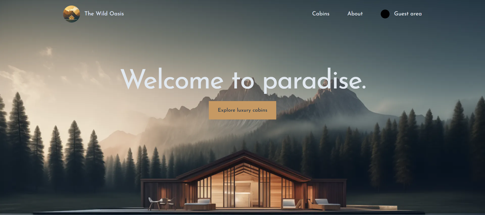

# 🏠 Wild-oasis-client-side
 <!-- Add a screenshot of the project -->
Welcome to wild-oasis project! This is a React-based web application for a cabins mangement. The project demonstrates advanced usage of Next js[App Router], Auth js, UI state with context API ,styling with tailwind css and Supabase for backend service .
# Features
- Cabins preview and reservations: create , updating and delete reservation.
- profile Managment : update info [country,national Id]
- Advanced Routing: Implemented using App Router.
- State Management: Efficient state management with context API.
- authentication and authorization using Auth js.
- optimaztions: using Next cache and Image optimaztions
- log-in using google
# live demo 
[Wild-oasis](https://the-wild-oasis-client-side.vercel.app/)

